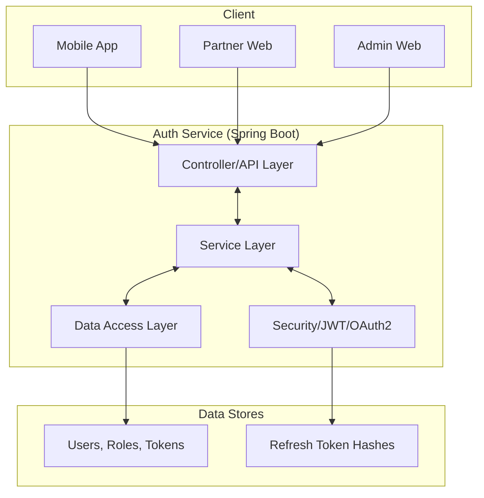
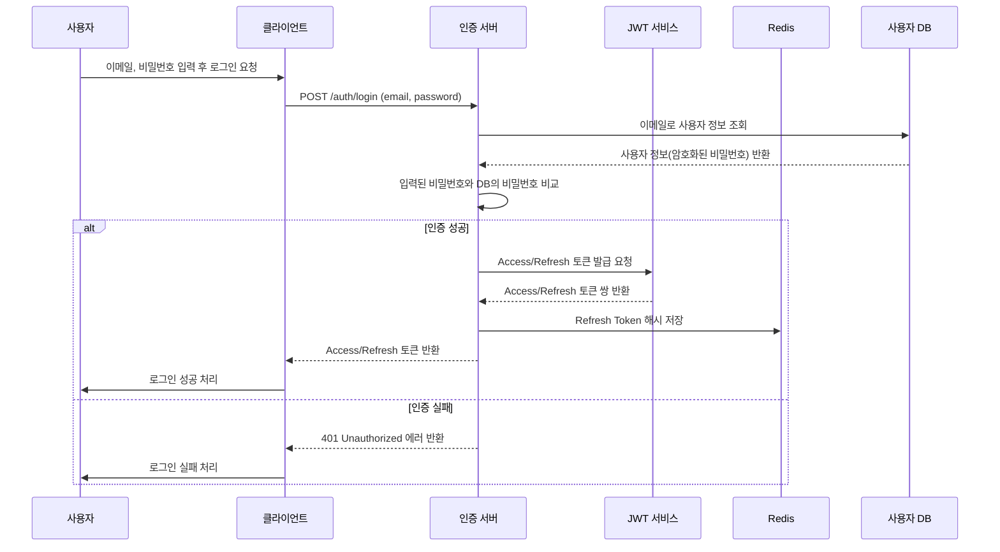
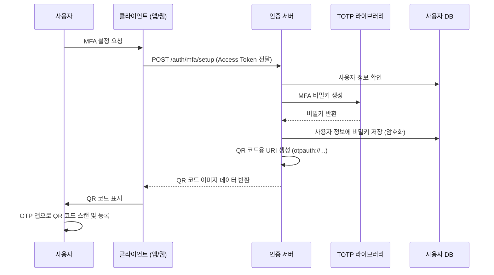

# 보호자·파트너·어드민이 공존하는 육아 플랫폼 (B2C) 의 통합 인증/인가 설계 및 핵심 API 구현

## 과제 개요

육아 플랫폼의 통합 인증/인가 시스템에 필요한 핵심 API를 Spring Boot로 구현합니다. 소셜 로그인 구현을 위해 GCP Oauth를 사용했으며, Docker Compose로 쉬운 빌드를 할 수 있도록 했습니다.

## 기술 스택

- Language: Java 21
- Spring Boot 버전: 3
- 주요 의존성: Spring Security
- DB: PostgreSQL, Redis
- 인증/인가: JWT (Access Token), Refresh Token Rotation, TOTP MFA, Google OAuth2
- Docs: SpringDoc (Swagger UI)
- 컨테이너: Docker
- IDE: IntelliJ IDEA Community Edition

## 실행 방법

해당 과제는 Docker Compose로 구동할 수 있도록 구성되어있습니다.

### 1. 필수 준비물

- Docker: Docker와 Docker Compose를 실행할 수 있는 환경이어야 합니다.
- GCP에서 OAuth 사용:
    1. GCP(Google Cloud Platform)에 접속합니다.
    2. API 및 서비스 > 사용자 인증 정보 메뉴에 접속합니다.
    3.  사용자 인증 정보 만들기 > OAuth 클라이언트 ID를 선택합니다.
    4.  애플리케이션 유형을 웹 애플리케이션으로 선택합니다.
    5.  승인된 리디렉션 URI에 `http://localhost:8080/login/oauth2/code/google`을 추가합니다.
    6.  생성 후 발급되는 클라이언트 ID와 클라이언트 보안 비밀을 저장하여 다음 `.env` 파일 설정 절차를 따릅니다.
    7. **키는 절대 유출하지 않도록 주의합니다.**

### 2. `.env` 파일 설정

프로젝트 루트 디렉토리에 `.env` 파일을 생성하고, 위에서 발급받은 Google OAuth2 정보를 다음과 같이 입력합니다.

```
GOOGLE_CLIENT_ID=[OAuth 클라이언트 ID]
GOOGLE_CLIENT_SECRET=[OAuth 클라이언트 시크릿]
```

### 3. 애플리케이션 실행

Docker 엔진이 가동중인지 확인 후, 프로젝트 루트 디렉토리에서 터미널을 열고 다음 명령어를 실행합니다.

```bash
docker-compose up -d --build
```

- 백엔드 API는 `http://localhost:8080`으로 접근 가능합니다.

### 4. 테스트 실행 (선택 사항)

프로젝트에 포함된 테스트 코드를 실행하여 기능의 유효성을 검증할 수 있습니다. **Testcontainers 관련 의존성이 필요하므로 Docker 구동이 필요합니다.**

```bash
./gradlew test

# Windows라면
gradlew.bat test
```

## 아키텍처 및 주요 흐름

### 시스템 아키텍처(Mermaid 문법으로 작성)

아래 mermaid 코드가 렌더링되지 않을 경우, https://mermaid.live/ 에서 렌더링 결과를 조회하거나 프로젝트에서 `diagrams` 디렉터리 안에 png 이미지들을 참고할 수 있습니다.



### 주요 흐름 시퀀스 다이어그램

#### 1. 아이디/비밀번호 로그인



#### 2. MFA(TOTP) 설정



## 운영 측면 고려사항

- Stateless 아키텍처: JWT 기반 인증을 통해 서버는 클라이언트의 세션 상태를 유지할 필요가 없어 수평 확장이 용이합니다.
- 데이터베이스 마이그레이션: Flyway를 사용하여 데이터베이스 스키마 변경 이력을 관리하고, 버전 관리를 통해 안정적인 배포를 지원합니다.
- 보안:
    * 비밀번호는 BCrypt로 해싱하여 저장합니다.
    * Refresh Token Rotation을 통해 토큰 탈취 시 피해를 최소화합니다.
    * TOTP MFA를 통해 계정 보안을 강화합니다.
    * JWKS 엔드포인트를 통해 공개 키를 안전하게 배포하고, 키 롤오버를 지원합니다.
* 환경 분리: Docker Compose를 통해 개발 환경과 프로덕션 환경을 유사하게 구성하여 환경 간 불일치로 인한 문제를 줄입니다.
* 로깅 및 모니터링: (구현되어 있다면) Spring Boot Actuator 등을 활용하여 애플리케이션 상태를 모니터링하고, 로그를 통해 문제 발생 시 원인 분석을 용이하게 합니다. (현재 프로젝트에는 명시적인 모니터링 설정은 없지만, 일반적인 고려사항으로 포함)

## 예상 운영 대응 시나리오

1. **데이터베이스 연결 장애:**
    * **증상:** 애플리케이션 시작 실패 또는 데이터베이스 관련 API 호출 시 에러 발생.
    * **대응:** Docker Compose 환경에서 `db` 서비스의 상태를 확인하고, 로그를 통해 DB 컨테이너의 문제(예: 시작 실패, 디스크 공간 부족)를 파악합니다. 필요시 DB 컨테이너 재시작 또는 볼륨 확인.
2. **애플리케이션 서버 응답 없음:**
    * **증상:** API 호출 시 타임아웃 또는 연결 거부.
    * **대응:** `app` 서비스 컨테이너의 상태 및 로그를 확인합니다. 메모리 부족, CPU 과부하, 또는 애플리케이션 내부 오류(예: 무한 루프, 데드락) 등을 파악하고, 필요시 컨테이너 재시작 또는 로그 상세 분석.
3. **토큰 유효성 문제 (로그인/인가 실패):**
    * **증상:** 유효한 자격 증명에도 불구하고 로그인 실패, 또는 권한이 있는 사용자가 특정 API 접근 시 403 Forbidden 에러 발생.
    * **대응:**
        * JWT Access Token의 만료 여부 확인.
        * Refresh Token이 블랙리스트에 등록되었는지 Redis 확인.
        * JWKS 엔드포인트 (`/.well-known/jwks.json`)가 정상적으로 동작하는지 확인하여 공개 키 유효성 검증.
        * 사용자 역할 및 MFA 상태 확인.
4. **Redis 연결 장애:**
    * **증상:** Refresh Token 갱신 실패, 세션 관련 기능 오류.
    * **대응:** `redis` 서비스 컨테이너의 상태 및 로그를 확인합니다. 필요시 Redis 컨테이너 재시작.

## API 문서 (Swagger UI)

애플리케이션이 성공적으로 실행되면, 다음 URL을 통해 Swagger UI 기반의 API 문서를 확인할 수 있습니다.

`http://localhost:8080/swagger-ui/index.html`

여기서 각 API 엔드포인트의 상세 정보, 요청/응답 스키마, 그리고 직접 API를 테스트해 볼 수 있는 기능을 제공합니다.
